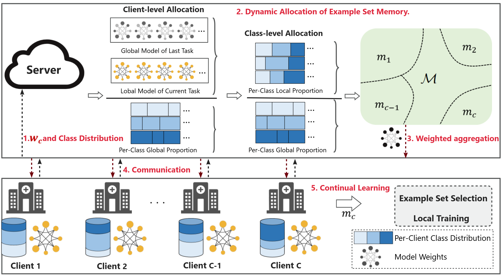

# FedDMR
This is the official PyTorch implementation for the paper: "[FedDMR: Federated Incremental Learning with
Dynamic Memory Replay Allocation](https://arxiv.org/abs/2305.05230)".

## Brief Introduction
This paper proposes a FIL framework for non-IID medical data.

## Dataset 
Matek-19:A single-cell morphological dataset of leukocytes from aml patients and non-malignant controls (aml-
cytomorphology lmu)
Acevedo-20: A dataset of microscopic peripheral blood cell images for development of automatic recogni-
tion systems.
WBC:A high-resolution large-scale dataset of pathological and normal white blood cells

# WTT:FL+CL
### datasets structure
The data structure is as follows(such as Matek-19)：
- Matek-19/
  - BAS/
    - BAS_0001.tiff
    - ...  
  - EOS/
    - EOS_0001.tiff
    - ...  
  - ...
 
Before running the algorithm, please execute: python data_preprocess.py
### settings
- CIL
  - Matek-19
    base_class:4
    way:3
    - session 0:0,1,2,3
    - session 1:4,5,6
    - session 2:7,8,9
    - session 3:10,11,12
  - Acevedo-20
    base_class:4
    way:3
    - session 0:0,1,2,3
    - session 1:4,5,6
    - session 2:7,8,9

  - WBC
    base_class:4
    way:2
    - session 0:0,1,2,3
    - session 1:4,5
    - session 2:6,7
    
- DIL
  - session 0:Matek-19
  - session 1:Acevedo-20
  - session 2:WBC
    
- CIL+DIL
  - session 0:matek19(0,1,2,3)
  - session 1:matek19(4,5,6)+acevedo(0,1,2)
  - session 2:acevedo(3,4,6)+wbc(0,1,3)
  - session 3:matek19(7,8)
  - session 4:aceve(7,8)
  - session 5:matek(9,10)+acevedo(10,11)+wbc(4,5)
  - session 6:matek(11,12)+wbc(8,10,11)

- ClientIL-CIL
  - session 0:5
  - session 1:6
  - session 2:6
  - session 3:7
- ClientIL-DIL
  - session 0:5
  - session 1:6
  - session 2:6
- Client-IL-CDIL
  - session 0:5
  - session 1:5
  - session 2:5
  - session 3:6
  - session 4:6
  - session 5:6
  - session 6:7
  - session 7:7
  - session 8:7
### methods
python train_FedCL.py

